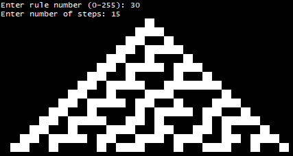
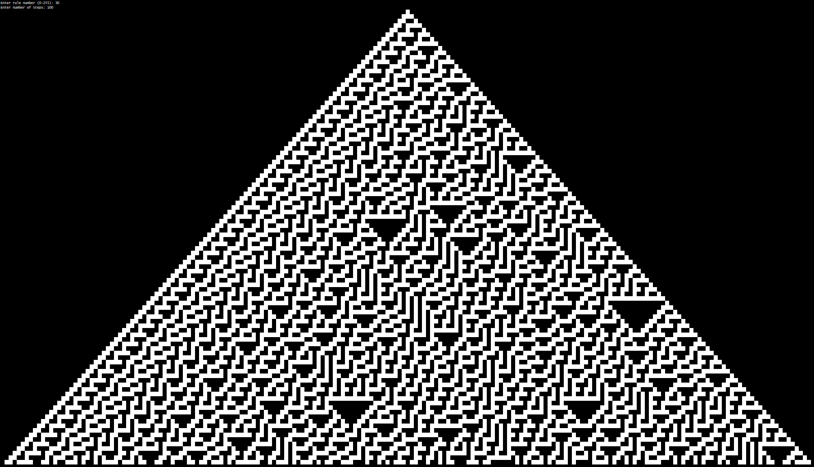

# Elementary Cellular Automaton

This repository implements an elementary cellular automaton in C++, allowing users to explore simple yet fascinating patterns generated by cellular automata. This simulation is based on Wolfram's rules for one-dimensional binary-state cellular automata.

## Features

- **Configurable rule (0-255)** and number of steps.
- **Dynamic visualization** of automaton evolution in the terminal.
- **Periodic boundary conditions**, emulating a continuous, toroidal structure.
- **Configurable build** with CMake and easy Visual Studio solution generation via batch script.

[View Documentation](docs/An%20In-Depth%20Analysis%20of%20an%20Elementary%20Cellular%20Automaton%20Implementation.pdf)

## Getting Started

### Prerequisites

- **CMake** for generating build configurations.
- **Visual Studio 2017-2022** (recommended) or another compatible C++ compiler.
- **Windows OS** (other platforms may require adjustments).

### Building the Project

1. **Generate Visual Studio Solution**  
   Run the provided batch script to generate a solution compatible with Visual Studio versions 2017 through 2022:
   ```bash
   generate_solution.bat
   ```

2. **Build the Visual Studio Solution**  
   It will be in the newly created ```build``` directory

### Running

After building, run the program. It will prompt for two inputs:

1. Rule Number (0-255): Select the automaton rule.
2. Number of Steps: Set the number of generations to display.

#### Example Execution
```bash
Enter rule number (0-255): 30
Enter number of steps: 15
```
### Output

The program displays each generation in the terminal, with cells represented as solid blocks or empty spaces. Modify the visual characters in the code if you prefer a different representation.

#### Rule 30 (15 steps)



#### Rule 30 (100 steps)

